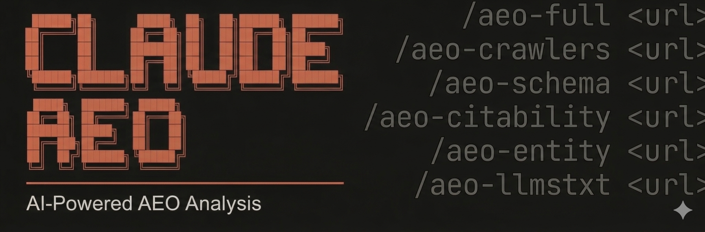

# Claude AEO



> A Claude Code skill that audits any website's AI visibility — 83 rules across 7 categories, per-platform scores for ChatGPT / Perplexity / Claude / Gemini / Grok, llms.txt generator, and paste-ready JSON-LD schemas.

Track your score weekly at **[aeobeast.co](https://aeobeast.co)** · npm library → **[@aeobeast/aeo-audit](https://github.com/aeobeast/aeo-audit)**

---

## Commands

| Command | What it does |
|---|---|
| `/aeo-full <url>` | Complete AEO audit — all categories in parallel. Overall score + per-platform scores + prioritized fixes. |
| `/aeo-crawlers <url>` | AI bot access — checks robots.txt against 19 AI crawlers (citation vs training), identifies blocks. |
| `/aeo-schema <url>` | Structured data — validates JSON-LD, generates missing Organization/FAQ/WebSite schemas. |
| `/aeo-citability <url>` | Content citability — detects citation-ready blocks, question headings, direct answers, statistical density. |
| `/aeo-entity <url>` | Brand/entity prominence — sameAs completeness, Knowledge Graph readiness, co-occurrence, authority profiles. |
| `/aeo-llmstxt <url>` | llms.txt — validates against llmstxt.org spec, generates a compliant file if missing. |

---

## Install

**1. Clone and copy skill files into your Claude config:**

```bash
git clone https://github.com/aeobeast/claude-aeo.git
cp -r claude-aeo/agents ~/.claude/
cp claude-aeo/SKILL.md ~/.claude/skills/claude-aeo.md
```

**2. Add to `~/.claude/CLAUDE.md`:**

```markdown
## Skills

@skills/claude-aeo.md
```

**3. Use in Claude Code:**

```
/aeo-full https://yourdomain.com
```

---

## What it audits

| Category | Weight | What it checks |
|---|---|---|
| **AI Crawlers** | 20% | Citation vs training bots, robots.txt blocks, crawl-delay |
| **Content Citability** | 20% | 134–167 word citable blocks, FAQs, stats, question headings |
| **Structured Data** | 15% | Organization, FAQPage, WebSite, Article, BreadcrumbList schemas |
| **E-E-A-T Signals** | 15% | Author, About/Contact pages, social proof, HTTPS |
| **Entity Prominence** | 15% | sameAs Knowledge Graph, authority domains, co-occurrence |
| **llms.txt** | 10% | Spec compliance, blockquote summary, link descriptions |
| **Technical AEO** | 5% | Sitemap, canonical, noindex, JS-gated content, title/meta |

---

## Powered by aeobeast.co

[AEOBeast](https://aeobeast.co) runs this audit weekly on your site, alerts you when your score drops, and automatically fixes issues — so you stay visible to AI search engines over time.

## License

MIT
